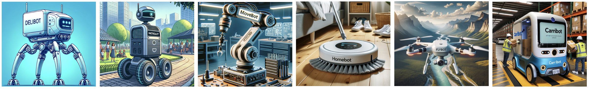

# RoWild
RoWild is a comprehensive and versatile cross-platform benchmark suite designed
for real-time robotics applications. It features an extensive collection of
kernels, developed to span the entire software pipeline typical of most
autonomous robotic systems. These kernels are integral in evaluating and
improving the performance of various components in robotic systems. The kernels
are developed using C++, CUDA, and Verilog, offering a framework for studying
and optimizing the performance across different processing units such as CPUs,
GPUs, and FPGAs. For more detailed information, installation guides, and user
support, visit the RoWild page at
[https://cmu-roboarch.github.io/rowild](https://cmu-roboarch.github.io/rowild/)

<p align="center">
  
</p>

## Key Features
RoWild offers essential features that make it ideal for systems and hardware
research:
- **Comprehensive:** RoWild includes a diverse range of robotic workloads.
- **High-Performance:** Performance is at the heart of RoWild's development,
  setting it apart from many other open-source robotic repositories. To
  optimize performance, RoWild develops codes in native languages and uses
  industry-standard profilers to identify execution bottlenecks and
  focuses on accelerating them. Further, RoWild makes use of various
  high-performance software techniques including `constexpr` branches and
  `constexpr` functions that enable the compiler to perform calculations at
  compile time, thereby improving execution by eliminating not-taken branches.
  RoWild utilizes built-in functions provided by GCC for aligning and prefetching
  data, providing branch prediction hints, and maximizing loop unrolling to
  enable efficient out-of-order execution. Additionally, RoWild makes use of the
  high-performance [VCL](https://github.com/vectorclass/version2) for manual code
  vectorization.
- **Simulator-Friendly:** RoWild is developed to be compatible with existing
  architectural simulators (e.g., no Python runtime). By default, RoWild's CPU
  codes are integrated with [zsim](https://github.com/s5z/zsim).
- **Cross-Platform:** RoWild caters to a wide range of compute resources by
  developing applications in C++, CUDA, and Verilog. 
- **Versatile:** RoWild is a versatile repository that not only comprises
  diverse robotic workloads but also develops each of them in a configurable
  manner. This configurability empowers users to perform each task using a range
  of algorithms and parameters, enabling the study of realistic robots that
  feature specialized software components for specific robotic applications and
  environments.
- **Modular:** RoWild embodies modularity in its design, enabling the seamless
  pipelining of different tasks to model end-to-end robotic applications.


## Repository Structure

This repository is organized into several key directories. Here's a brief
overview of the major directories and their contents:

### `/cpu` (CPU Source Codes)
- **Description:** Contains all the source code files, along with the inputsets
  and other necessary files, for RoWild's CPU segment.
- **Contents:** 
  - `/src`: Implementation of RoWild's individual CPU tasks/kernels.
  - `/include`: Miscellaneous, shared functions CPU codes utilize.
  - `build.sh`: Script for building all CPU tasks.
  - `clean.sh`: Script for cleaning all CPU builds.
  - `makefile.rules`: Build rules for CPU tasks.

### `/gpu` (GPU Source Codes)
- **Description:** Contains all the source code files, along with the inputsets
  and other necessary files, for RoWild's GPU segment.
- **Contents:** 
  - `/src`: Implementation of RoWild's individual GPU tasks/kernels.
  - `/include`: Miscellaneous, shared functions GPU codes utilize.
  - `build.sh`: Script for building all GPU tasks.
  - `clean.sh`: Script for cleaning all GPU builds.
  - `makefile.rules`: Build rules for GPU tasks.

### `/fpga` (FPGA Source Codes)
- **Description:** Contains all the source code files, along with the other
  necessary files, for RoWild's FPGA segment.
- **Contents:** Verilog implementation, along with Tool Command Language (TCL)
  files, of RoWild's individual tasks/kernels designed for FPGA execution.

### `/e2e` (End-to-End Robots Modeled)
- **Description:** Contains six exemplar end-to-end robotic applications
  implemented using RoWild's individual tasks.
- **Contents:** 
  - `/src`: Implementation of RoWild's end-to-end robots.
  - `build.sh`: Script for building all end-to-end applications.
  - `clean.sh`: Script for cleaning all builds.

### `/scripts` (Scripts)
- **Description:** Contains some scripts mostly for checking and enforcing
  coding conventions.

## Requirements
The CPU kernels have been tested under Ubuntu 22.04.1 LTS with Linux Kernel
5.15 and compiled with GCC 11.3. However, RoWild can be used with a variety of
other operating systems and compilers as well. As the benchmarks are coded with
C++17, the minimum required GCC version is 8.0 (Clang: 5.0; Visual Studio:
15.8).

The GPU Kernels are developed in CUDA 11 and compiled with NVCC. The FPGA
kernels are developed by a combination of manual implementation and high-level
synthesis using Vivado HLS. Likewise, the GPU and FPGA kernels could be used in
a variety of other settings, as long as the software prerequisites are
satisfied.

## Build
Every task/kernel/application can be built using the following command:
```
$ make
```

### Build for Performance
To build the codes for the highest performance, use the following command:
```
$ make performance
```

This way, the pieces of the code that are written for the purpose of
verification will be omitted, resulting in faster executions.

### Build for Debug
To build the codes for debugging them, use the following command:
```
$ make debug
```

### Build & Clean All
Use `build.sh` and `clean.sh` scripts to build and clean *all* of the
implementations under the path.

## Run
To run every task, simply issue the following command:
```
$ ./BINARY_NAME ARGS [ARGS]
```

Some of the arguments are required (e.g., input map, etc), and some of them are
optional. To see the description of the arguments, run the following command:
```
$ ./BINARY_NAME --help
```

Alternatively, you can put your desired parameters into the `run_all.sh`
scripts available in the tasks' directories, and issue the following command:
```
$ ./run_all.sh
```

## Contributing
We warmly welcome contributions to the RoWild benchmark suite! Whether you're
fixing bugs, adding new features, improving documentation, or spreading the
word, your contributions are greatly appreciated. To submit your contributions,
please open a pull request and provide a clear description of your changes.

## Citation
Additional information about the suite, encompassing workload characterization
and analysis of system-level implications, can be found in this paper:
>Mohammad Bakhshalipour and Phillip B. Gibbons,
>"[**Agents of Autonomy: A Systematic Study of Robotics on Modern Hardware**](https://dl.acm.org/doi/10.1145/3626774)",
>in _Proceedings of the ACM on Measurement and Analysis of Computing Systems (POMACS)_, 2023, and
>in _Proceedings of the ACM International Conference on Measurement and Modeling of Computer Systems (SIGMETRICS)_, June 2024.

## Questions and Support

If you have any questions, need clarification, or require further support
regarding the RoWild benchmark suite, please do not hesitate to reach out. You
can email me directly at
[m.bakhshalipour@gmail.com](mailto:m.bakhshalipour@gmail.com). I aim to respond
as promptly as possible and am always happy to assist.

## License
```
MIT License

Copyright (c) 2023 Carnegie Mellon University

Permission is hereby granted, free of charge, to any person obtaining a copy
of this software and associated documentation files (the "Software"), to deal
in the Software without restriction, including without limitation the rights
to use, copy, modify, merge, publish, distribute, sublicense, and/or sell
copies of the Software, and to permit persons to whom the Software is
furnished to do so, subject to the following conditions:

The above copyright notice and this permission notice shall be included in all
copies or substantial portions of the Software.

THE SOFTWARE IS PROVIDED "AS IS", WITHOUT WARRANTY OF ANY KIND, EXPRESS OR
IMPLIED, INCLUDING BUT NOT LIMITED TO THE WARRANTIES OF MERCHANTABILITY,
FITNESS FOR A PARTICULAR PURPOSE AND NONINFRINGEMENT. IN NO EVENT SHALL THE
AUTHORS OR COPYRIGHT HOLDERS BE LIABLE FOR ANY CLAIM, DAMAGES OR OTHER
LIABILITY, WHETHER IN AN ACTION OF CONTRACT, TORT OR OTHERWISE, ARISING FROM,
OUT OF OR IN CONNECTION WITH THE SOFTWARE OR THE USE OR OTHER DEALINGS IN THE
SOFTWARE.
