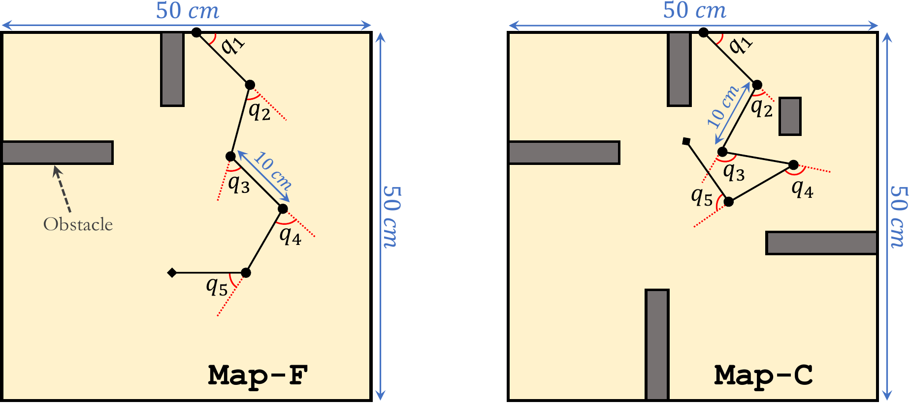

# Stationary Robotic Arm Planning in 2D Environments
This directory provides the implementation of stationary robotic arm planning
using sampling planners.

## Description
The program uses sampling-based planners (e.g., PRM, RRT) to find an efficient,
collision-free path from a start point to a goal point in the environments
shown below.

  

The output of the program is a set of angles in N-dimensional state space that
guides the robot's end-effector to reach the goal.

## Code & Data
The planning algorithm is taken as input. For example, running the program
with `--planner RRTStar` will search for the path using RRT\* algorithm.

`input-maps/` includes the map of the environments (the first line indicates
the size of the map).

`input-cfgs/` includes the configuration of the arm (e.g., the degree of
freedom, the length of the links), as well as a set of input-output
configuration pairs that the planners use as input.

`run_all.sh` sweeps different execution parameters (e.g., heuristic weight) and
runs an experiment per configuration.
