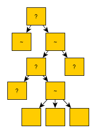

# Behavior Tree
This directory provides an implementation of the Behavior Tree (BT) algorithm
for a robot whose mission is to fetch a book from a shelf.

## Description
Behavior Trees (BTs) are a tool used for defining hierarchical behaviors for
robots. BTs are a generalization of Finite State Machines (FSMs) and Decision
Trees.

In this code, a robot must fetch a book from a shelf. The tasks could be broken
down into:
1. Navigate to the shelf.
2. Search for the book.
3. Pick up the book.
4. Return to the starting position.

  

Each task might have potential failures or conditions to check. For example,
when navigating, the robot needs to make sure the path is clear. If it's not,
the robot might need to either wait or find an alternate path. When searching
for the book, if the book isn't found on the first attempt, it might need to
try again.
