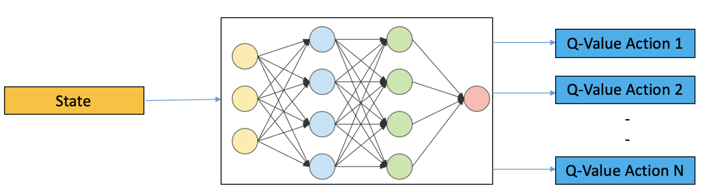

# Deep Q Network (DQN)
This directory provides the implementation of a DQN-based planning.

## Description
Deep Q-Network (DQN) is a reinforcement learning algorithm that combines
Q-Learning with deep neural networks, aiming to learn optimal policies in
high-dimensional input spaces effectively. DQN extends the functionality of
traditional tabular Q-Learning by approximating the Q-values using a neural
network, enabling the handling of environments with larger state spaces like
image inputs.

  

