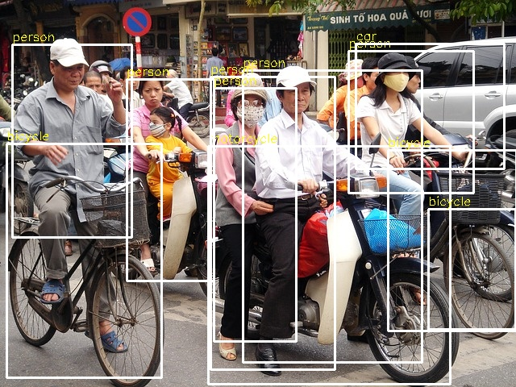

# Object Detection using Deep Neural Networks
This directory provides the implementation of object detection using deep
neural networks (DNNs).

## Description
The program uses a pre-trained DNN model (in
[TensorFlow](https://www.tensorflow.org/)) to detect different objects. The
model is trained on the [MS COCO](https://cocodataset.org/#home) dataset. The
program outputs an image in which different objects are boxed with labels, as
shown below.

  

## Code & Data
Four files must be provided as inputs to the program. `--label` takes class
names, `--model` takes the pre-trained model file containing weights, `--cfg`
takes the model configuration file, and `--img` takes the input image. An
example of these input files is placed in `input-data/`:
`object_detection_classes_coco.txt` is a label file,
`frozen_inference_graph.pb` is a model file,
`ssd_mobilenet_v2_coco_2018_03_29.pbtxt.txt` is a configuration file, and
`img.jpg` is an input image file.

`run_all.sh` sweeps different execution parameters (e.g., image scaling factor)
and runs an experiment per configuration.

## Notes
You have to [install
OpenCV](https://www.geeksforgeeks.org/how-to-install-opencv-in-c-on-linux/) to
compile/link/execute the program.

## Acknowledgment
We have largely followed [OpenCV's
example](https://learnopencv.com/deep-learning-with-opencvs-dnn-module-a-definitive-guide/)
in coding this program.
