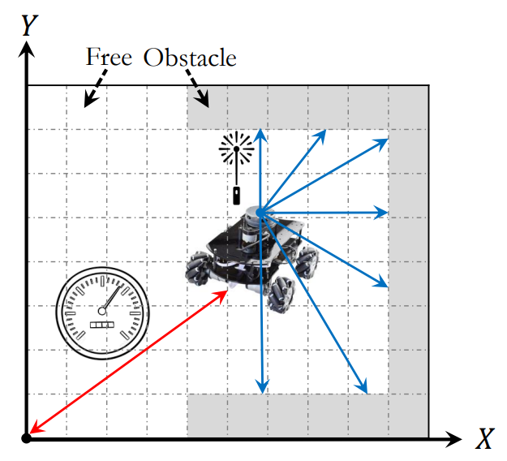
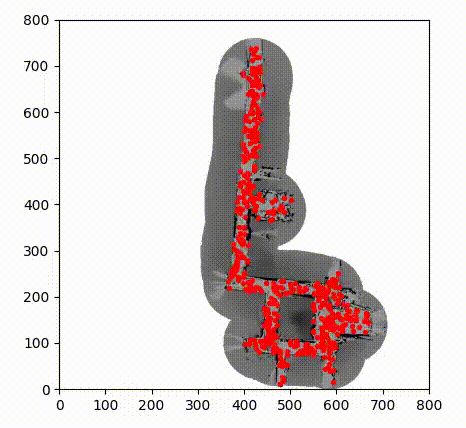
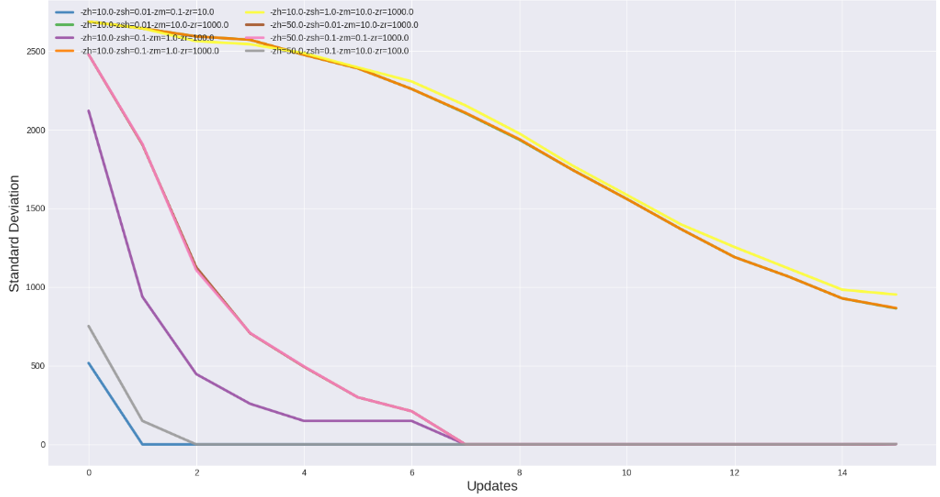
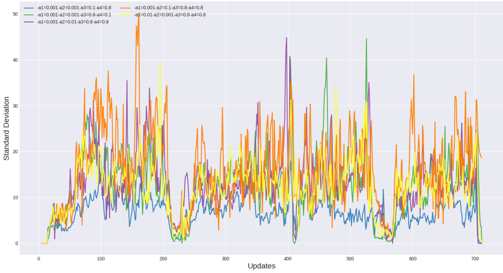

# Monte Carlo Localization
This directory provides an implementation of Monte Carlo Localization (MCL).

## Description
The program models a robot operating in a 2D environment, as shown in the
figure below. The animation shows how the algorithm localizes the robot over
time in the modeled environment.

  
  

The state of the robot is defined by (x, y, $\theta$), where (x, y) is its
location and $\theta$ is its orientation. The robot is equipped with an
odometer and a laser rangefinder.

## Parameter tuning
The motion and sensor model parameters must be tuned for the given application
(see `initializeMotionModel()` `initializeSensorModel()` in `pfilter.cpp`). The
default values are tuned for the Wean Hall (see below), in which we have
evaluated the program.

With chosen parameters, not only do the particles converge to the correct
place, but they also converge quickly. The following figure  shows how the
standard deviation of particles (x, y, theta) vary over time with several
configurations of motion (left) and sensor (right) models. As it is shown, the
chosen configuration (blue line) converges very quickly.

  
  

## Code & Data
`input-maps/` includes the map of the environment. We have included the map of
CMU's Wean Hall (courtesy of Michael Montemerlo). The numbers in the map file
represent the "occupation probability." E.g., cells whose value is zero are
definitely free, and the cells whose value is one are definitely occupied.
Cells with a probability of -1 are unknown: the robot has no clue about their
occupancy status. Observing the provided map's template and norms, any other
maps can be smoothly used.

`input-measurements/` includes sensory data. Every line includes 3 + 180
numbers. The first three are odometry measurements, and the rest are laser
readings in cm. The 180 readings span 180 degrees starting from the right and
going left. We have included the measurements of only one scenario. You can
download further logs from
[here](https://cmu.box.com/s/fshj3cjsn0qbutn3osk9l4z83w63w7co).

`kidnapped-log/` includes sensory data for a kidnapped robot scenario.

`run_all.sh` sweeps different execution parameters (e.g., the number of
particles) and runs an experiment per configuration.
