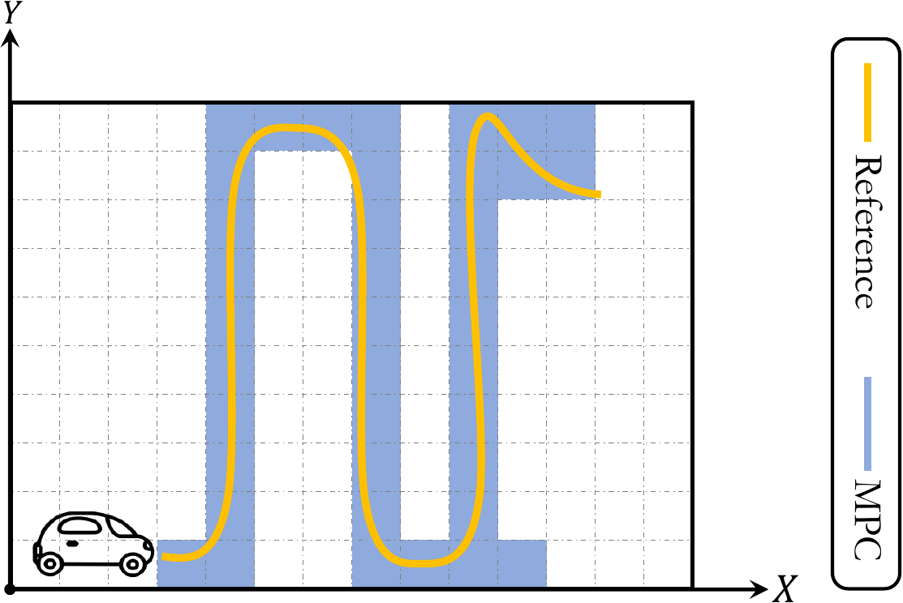

# Model Predictive Control
This directory provides the implementation of Model Predictive Control (MPC).

## Description
The program generates inputs to the robot's actuators to efficiently follow the
path absorbed from the planning stage while observing several constraints. For
example, with a self-driving car, the constraints could be the maximum speed,
and the goal could be following a path with minimum fuel usage.

The figure below shows an overview of the program in an environment modeling a
self-driving car following a long reference trajectory while not exceeding
predefined velocity and acceleration thresholds.

  

## Code & Data
`input-trajs/` includes a synthetic reference trajectory.

`run_all.sh` sweeps different execution parameters (e.g., time steps) and runs
an experiment per configuration.

To solve the optimization problem, we use
[CVXGEN](https://cvxgen.com/docs/index.html). CVXGEN performs most
transformations and optimizations *offline* and generates a super-fast C code
tailored for the optimization problem. As most of the process is done offline,
the code must be re-generated if the problem's dimensions change. To
generate the code for a new problem, please follow the steps explained
[here](https://cvxgen.com/licenses/new) and get a free academic license. Then
describe the new problem using CVXGEN's language (our definition can be found
in `description.cvxgen`). Once the code is generated, run the provided
`scripts/refine_cvxgen.sh` script on it to get it worked with the rest of the
project.

## Acknowledgment
We have largely followed [PythonRobotic's
implementation](https://github.com/AtsushiSakai/PythonRobotics/blob/master/PathTracking/model_predictive_speed_and_steer_control/model_predictive_speed_and_steer_control.py)
in coding this program. But ours is by far faster!
