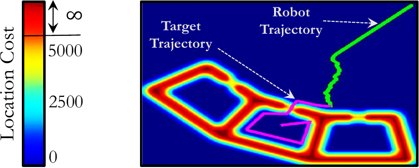

# Catching a Moving Target
This directory provides the implementation of a robot trying to catch a moving
target.

## Description
The program uses the A\* algorithm to search a conceptual 3D state space in
which the third dimension is *time*. The heuristic values that the A\*
algorithm uses are calculated by a backward Dijkstra run. Every location in the
environment has a particular cost for the robot. The goal of the robot is to
catch the target with minimum cost. The figure below shows the planning
scenario in the environments we have included.

  

## Code & Data
`input-maps/` includes a synthetic map. The format of the map is as follows:
- `N` indicates the size of the map.
- `C` indicates the *collision threshold*. Every cell whose value is larger
  than `C` is an obstacle.
- `R` indicates the initial position of the robot.
- `T` indicates the trajectory of the moving target.
- `M` indicates the cost of the cells in the map.

You can download further maps from
[here](https://cmu.box.com/s/e16fbl18d6p1w6xx6v7n3iea4c5s6o97).

`run_all.sh` runs the program on all of the maps.
