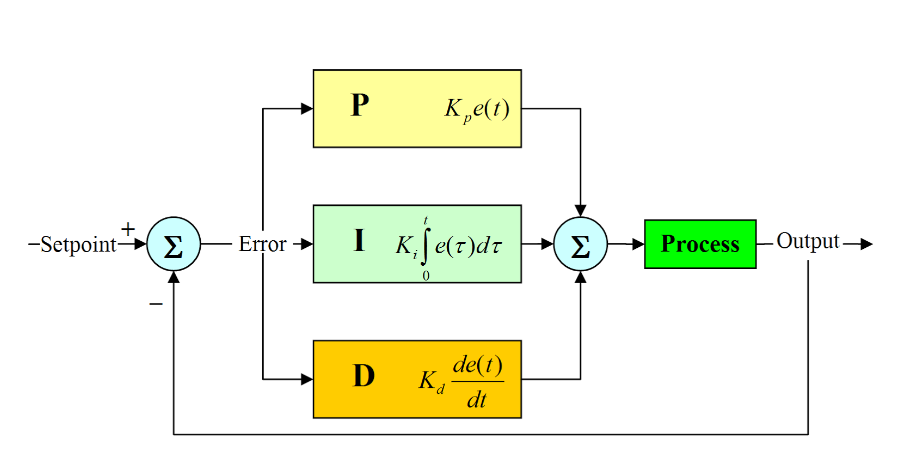

# PID
This directory provides the implementation of the PID controller.

## Description
The Proportional-Integral-Derivative (PID) controller is a control loop
feedback mechanism that is used in control systems such as robotics. It
calculates an "error" value as the difference between a desired setpoint and a
measured process variable. The controller attempts to minimize this error by
adjusting the process control inputs.

  

## Code & Data
`input-logs/` includes a script for generating random "desired-current" value
pairs, and an output of it.

`run_all.sh` sweeps different execution parameters (e.g., gain values) and runs
an experiment per configuration.
