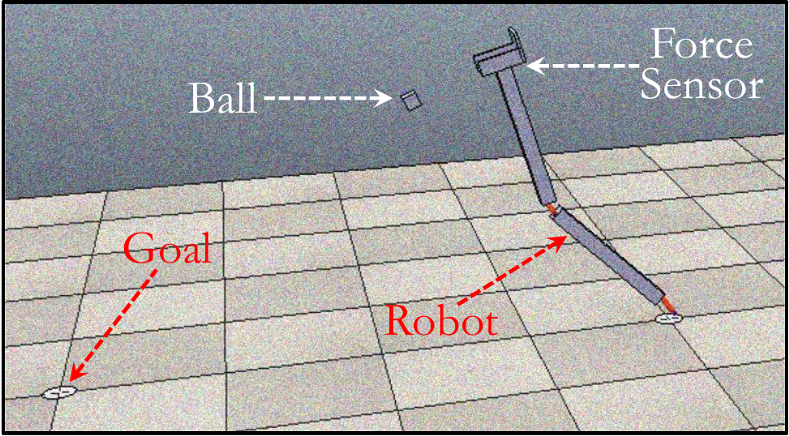

# Bayesian Optimization
This directory provides the implementation of Bayesian Optimization (BO) for a
ball-throwing robot.

## Description
The program models a ball-throwing robot whose throwing skills get improved by
reinforcement learning using BO.  We use
[CoppeliaSim](https://www.coppeliarobotics.com) to simulate the robot and the
environment, as shown in the figure below.

  

## Code & Data
`simulator.txt` is the log taken from the simulator. Every line includes the
parameters (e.g., force) and the corresponding location of the ball.

`run_all.sh` sweeps different execution parameters (e.g., number of samples)
and runs an experiment per configuration.
