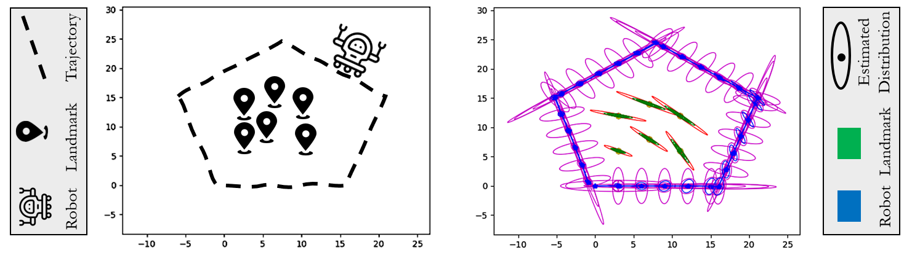

# Simultaneous Localization and Mapping
This directory provides an implementation of Simultaneous Localization and
Mapping (SLAM).

## Description
The program models a wheeled robot operating in a 2D environment, as shown in
the figure below (left). The right figure shows the estimated trajectory of the
robot, as well as the estimated location of the landmarks in the environment.
The ellipses show the uncertainties the method accounts for in its estimations.

  

## Code & Data
`input-logs/` includes a scenario with six landmarks. The log file includes 1)
control inputs (distance traveled by the robot and its rotation) and 2)
measurements (bearing angle and range of six landmarks).
