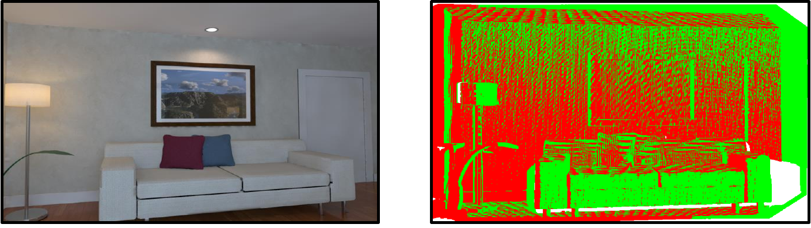

# Scene Reconstruction
This directory provides an implementation of the Iterative Closest Point (ICP)
for Scene Reconstruction (SR).

## Description
The program captures the shape and appearance of the objects in the 3D
environment shown in the figure below (left). It evaluates different point
clouds using the ICP algorithm to reconstruct the scene; the reconstructed
scene is shown in the figure below (right).

  

## Code & Data
As the inputset of the program is large, we have not put the used inputset in
the repository. Instead, you can download it from
[here](https://cmu.box.com/shared/static/viydksoj273imvg24w6png5h4wutt03y.gz)
or use the `download-inp.sh` script to download it.

To evaluate the kernel on further datasets (see
[ICL-NUIM](https://www.doc.ic.ac.uk/~ahanda/VaFRIC/iclnuim.html),
[Hypersim](https://github.com/apple/ml-hypersim),
[ScanNet](http://www.scan-net.org),
[RGBD1K](https://drive.google.com/drive/folders/1Z2PnWEgdZG0KVI2MX5chWddNlbuuEug3)),
download them and run `python3 preprocess.py path/to/dataset
path/to/ground/truth` for preparing them to be used smoothly with the
implemented kernel-inputset interface.

`run_all.sh` sweeps different execution parameters (e.g., downsampling) and
runs an experiment per configuration.

## Notes
This program is extremely memory intensive. Running multiple instances of it in
parallel may cause out-of-memory errors; that is why the `run_all.sh` script
does *not* run different experiments in parallel.
