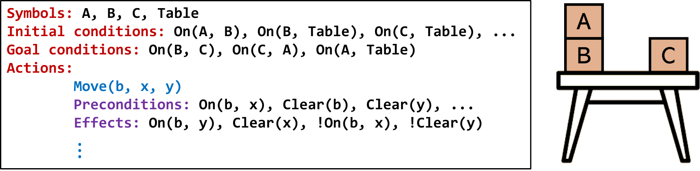

# Symbolic Planning
This directory provides the implementation of symbolic planning.

## Description
The program takes a symbolically-defined problem language and outputs a set of
actions to satisfy the goal condition. The input language is based on [Stanford
Research Institute Problem Solver
(STRIPS)](https://en.wikipedia.org/wiki/Stanford_Research_Institute_Problem_Solver).
The figure below illustrates the STRIPS language for a Blocksworld problem.

  

## Code & Data
`input-problems/` includes three problems: Blocksworld, Fire Extinguishing, and
Home Assistance. Any other problem described in the STRIPS language can be
readily used.

`run_all.sh` sweeps different execution parameters (e.g., heuristic weight) and
runs experiments on all problems.
