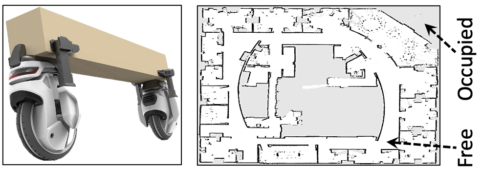

# CarriBot: Driverless Vehicle Transporting Goods
This directory provides the implementation of CarriBot, a transportation robot.

## Description
CarriBot is a driverless vehicle designed to optimize transport processes for
time-sensitive materials such as those used in chip manufacturing.

  

## Code & Data
`input-maps/` includes an aerial map of Intel's research lab, taken from
[here](https://ieeexplore.ieee.org/document/6280136).

`parallel_hashmap/` includes header files of [Abseil hash
tables](https://greg7mdp.github.io/parallel-hashmap/), used to implement fast,
parallel hashmaps for the A\* algorithm.

`run_all.sh` sweeps different execution parameters (e.g., search heuristic) and
runs an experiment per configuration.
