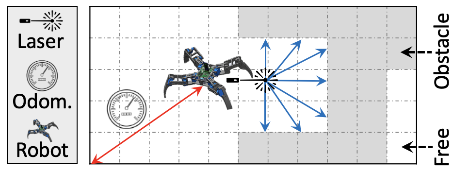

# DeliBot: Legged Robot Delivering Items
This directory provides the implementation of DeliBot, a delivery robot.

## Description
DeliBot is a legged robot capable of transporting loads. It navigates the
environment and delivers items to various locations.

  

## Code & Data
`input-maps/` includes the map of the environment. We have included the map of
[CMU's Wean
Hall](https://www.cmu.edu/computing/services/teach-learn/tes/classrooms/locations/wean.html)
(courtesy of Michael Montemerlo). The numbers in the map file represent the
"occupation probability." E.g., cells whose value is zero are definitely free,
and the cells whose value is one are definitely occupied.  Cells with a
probability of -1 are unknown: the robot has no clue about their occupancy
status. Observing the provided map's template and norms, any other maps can be
smoothly used.

`input-measurements/` includes sensory data. Every line includes 3 + 180
numbers. The first three are odometry measurements, and the rest are laser
readings in cm. The 180 readings span 180 degrees starting from the right and
going left. We have included the measurements of only one scenario. You can
download further logs from
[here](https://cmu.box.com/s/fshj3cjsn0qbutn3osk9l4z83w63w7co).

`run_all.sh` sweeps different execution parameters (e.g., the number of
particles) and runs an experiment per configuration.
