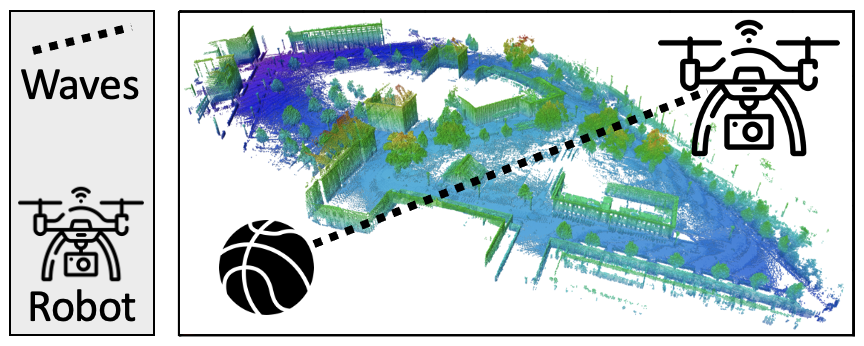

# FlyBot: Drone Performing Aerial Photography
This directory provides the implementation of FlyBot, a pilotless drone.

## Description
FlyBot is a pilotless drone that covers sports events on the Freiburg campus,
tracking a specific object such as a ball and adjusting its position to
maintain a seamless view of the target area. The program uses
[Ipopt](https://coin-or.github.io/Ipopt/), a library for large-scale nonlinear
optimization, to control the drone.

  

## Code & Data
`input-maps/` includes the map of the Freiburg campus, taken from
[OctoMap](http://ais.informatik.uni-freiburg.de/projects/datasets/octomap/).

`coin/` includes header files of [Ipopt](https://coin-or.github.io/Ipopt/).

`parallel_hashmap/` includes header files of [Abseil hash
tables](https://greg7mdp.github.io/parallel-hashmap/), used to implement fast,
parallel hashmaps for the A\* algorithm.

`run_all.sh` sweeps different execution parameters (e.g., search heuristic) and
runs an experiment per configuration.
