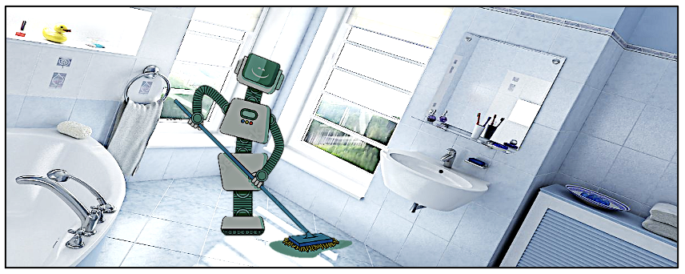

# HomeBot: Assistant Robot Cleaning House
This directory provides the implementation of HomeBot, a home-cleaning robot.

## Description
HomeBot is a home-assistant robot performing missions like collecting debris.

<p align="center">
  
</p>

HomeBot employs a reactive planning and control to clean the house, where the
cleaning method is determined based on, say, the size of the dirty spot. This
reactive approach is implemented using a Behavior Tree, as follows.

```
Root (Selector)
    Is Battery Low? (Condition)
        Go to Charging Station (Action)
    Is Dustbin Full? (Condition)
        Empty Dustbin (Action)
    Clean Area (Sequence)
        Find Dirty Area (Action)
        Clean Current Area (Action)
```

## Code & Data
As the inputset of the program is large, we have not put the used inputset in
the repository. Instead, you can download it from
[here](https://cmu.box.com/shared/static/viydksoj273imvg24w6png5h4wutt03y.gz)
or use the `download-inp.sh` script to download it.

To evaluate the kernel on further datasets (see
[ICL-NUIM](https://www.doc.ic.ac.uk/~ahanda/VaFRIC/iclnuim.html),
[Hypersim](https://github.com/apple/ml-hypersim),
[ScanNet](http://www.scan-net.org),
[RGBD1K](https://drive.google.com/drive/folders/1Z2PnWEgdZG0KVI2MX5chWddNlbuuEug3)),
download them and run `python3 preprocess.py path/to/dataset
path/to/ground/truth` for preparing them to be used smoothly with the
implemented kernel-inputset interface.

`vcl/` includes header files of Agner Fog's [vector class
library](https://github.com/vectorclass/version2) used for vectorization.

`run_all.sh` sweeps different execution parameters (e.g., downsampling) and
runs an experiment per configuration.
