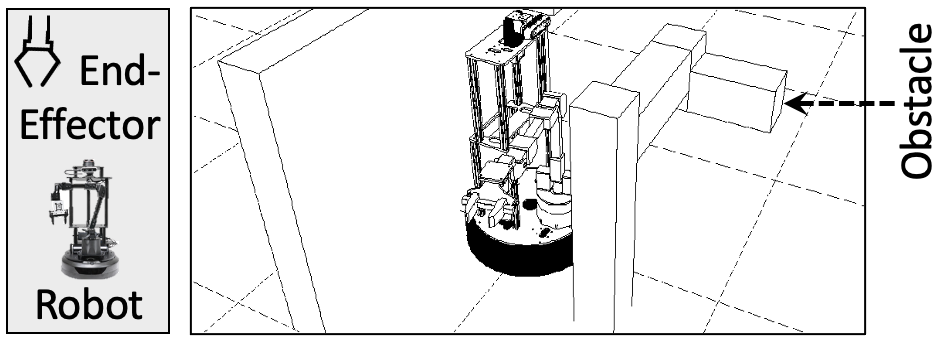

# MoveBot: Arm Manipulator Moving Items
This directory provides the implementation of MoveBot, a robotic manipulator.

## Description
MoveBot is a manipulator equipped with a 5-DoF robotic arm that excels at
moving objects. The MoveBot is carefully modeled after
[LoCoBot](http://www.locobot.org).

The program modeling the robot uses sampling-based planners (e.g., PRM, RRT)
to find an efficient, collision-free path from a start point to a goal point.
The output of the program is a set of angles in 5-dimensional state space
that guides the robot's end-effector to reach the goal.

  

## Code & Data
`input-maps/` includes the map of the environments.

`vcl/` includes header files of Agner Fog's [vector class
library](https://github.com/vectorclass/version2) used for vectorization.

`run_all.sh` sweeps different execution parameters (e.g., number of samples)
and runs an experiment per configuration.
