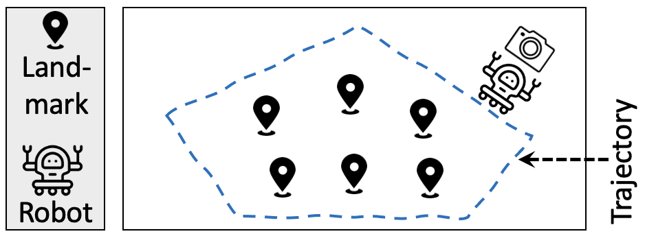

# PatrolBot: Wheeled Robot Patrolling Campus
This directory provides the implementation of PatrolBot, a surveillance robot.

## Description
PatrolBot is a wheeled robot that is responsible for patrolling CMU's campus
and detecting suspicious objects. Due to the dynamic nature of the
environment, PatrolBot does not rely on a static map to navigate. Instead, it
performs simultaneous localization and mapping (SLAM), which involves
creating a map of the environment as it moves around and determining its own
position in that map. To accomplish this task, PatrolBot uses six identified
landmarks throughout the campus.

The program uses a pre-trained DNN model (in
[TensorFlow](https://www.tensorflow.org/)) to detect different objects. The
model is trained on the [MS COCO](https://cocodataset.org/#home) dataset.

  

## Code & Data
`sensor-logs/` includes a scenario with six landmarks. The log file includes 1)
control inputs (distance traveled by the robot and its rotation) and 2)
measurements (bearing angle and range of six landmarks).

`mobilenet-data/` includes files that needed to be provided to the program. It
encompasses `object_detection_classes_coco.txt`, which includes the object
labels; `frozen_inference_graph.pb`, which is the used neural network model;
`ssd_mobilenet_v2_coco_2018_03_29.pbtxt.txt`, which is the configuration file.

The program also needs a series of images as the inputset. Run
`download-inp.sh` to download such an inputset. The script will download
several images showing CMU's Pittsburgh campus, extracted from
[this](https://youtu.be/WjhhLkCEly4?si=8_TrjjhPODOkWOUK), in `cmu-tour`
directory.

`run_all.sh` sweeps different execution parameters (e.g., confidence threshold)
and runs an experiment per configuration.
