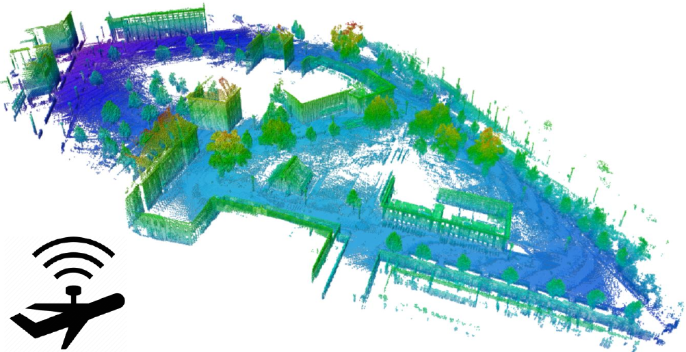

# Pilotless drone navigation
This directory provides an implementation of 3D Path Planning.

## Description
The program uses A\* graph search to find an efficient (short), collision-free
path from a start point to a goal point in the 3D environment shown in the
figure below. The program resembles a pilotless drone navigating in an outdoor
environment.

  

## Code & Data
`input-maps/` includes the map of the Freiburg campus, taken from
[OctoMap](http://ais.informatik.uni-freiburg.de/projects/datasets/octomap/).

`run_all.sh` sweeps different execution parameters (e.g., search heuristic) and
runs an experiment per configuration.

`mgpucontext.cu` and `mgpuutil.cpp` are part of
[moderngpu](https://github.com/moderngpu/moderngpu) library.
