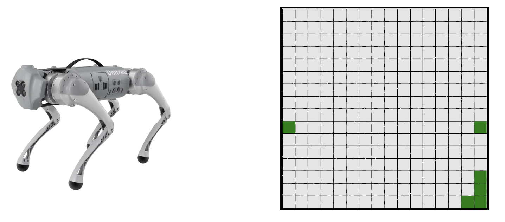

# Legged Robot Navigation
This directory provides an implementation of 2D Path Planning.

## Description
The program uses A\* graph search to find an efficient (short), collision-free
path from a start point to a goal point in the 2D environment shown in the
figure below (right). The program resembles a legged robot.

  

## Code & Data
`input-maps/` includes a synthetic map taken from [Moving
AI](https://www.movingai.com). All other [similar
maps](https://movingai.com/benchmarks/room/index.html) can be readily used.

`run_all.sh` sweeps different execution parameters (e.g., search heuristic) and
runs an experiment per configuration.

`mgpucontext.cu` and `mgpuutil.cpp` are part of
[moderngpu](https://github.com/moderngpu/moderngpu) library.
